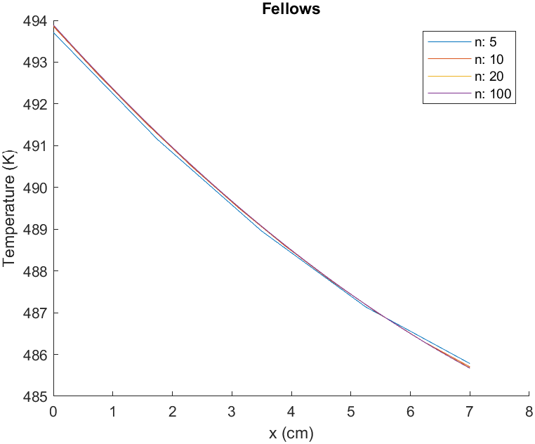

## 1.
From figure 4, we can see that for a central difference approximation of $T'_{i-1/2}$ using $T_{i-1}$ and $T_i$:
$$h = \frac{\Delta x}{2}$$  
We can then calculate the Taylor series expansion at $T_i$ and $T_{i-1}$ as:
$$T_i = T_{i-\frac{1}{2}}+hT'_{i-\frac{1}{2}}+\frac{h^2}{2}T'''_{i-\frac{1}{2}}+\frac{h^3}{3!}T'''_{i-\frac{1}{2}}+\cdots$$
$$T_{i-1} = T_{i-\frac{1}{2}}-hT'_{i-\frac{1}{2}}+\frac{h^2}{2}T'''_{i-\frac{1}{2}}-\frac{h^3}{3!}T'''_{i-\frac{1}{2}}+\cdots$$
For a central difference approximation, we subract $T_{i-1}$ from $T_i$:
$$T_i - T_{i-1} = 2hT'_{i-\frac{1}{2}}-\frac{2h^3}{3!}T'''_{i-\frac{1}{2}}-\cdots$$
We can then truncate and add the error term:
$$T_i - T_{i-1} = 2hT'_{i-\frac{1}{2}}+O(h^3)$$
Finally we solve for $T'_{i-1/2}$:
$$T_{i-\frac{1}{2}}'=\frac{T_i-T_{i-1}}{2h}+\frac{O(h^3)}{2h}$$
Simplifiying the error term shows that this is second order accurate:
$$T_{i-\frac{1}{2}}'=\frac{T_i-T_{i-1}}{2h}+O(h^2)$$
And substitute $\Delta x$ back in for the final equation:
$$T_{i-\frac{1}{2}}'=\frac{T_i-T_{i-1}}{\Delta x}$$

## 2.

Substituting the taylor series representation of $T'_{i-1/2}$ and $T'_{i+1/2}$ into the energy balance gives:
$$-kA_{i-\frac{1}{2}}\frac{T_i-T_{i-1}}{\Delta x}+kA_{i+\frac{1}{2}}\frac{T_{i+1}-T_i}{\Delta x}-2\cdot h(x) \cdot A_c(T_i-T_\infty) = 0$$

Which we can then rearange into the form $e_iT_{i-1} + f_iT_i + g_iT_{i+1} = r_i$:
$$\frac{kA_{i-\frac{1}{2}}}{\Delta x}T_{i-1}     -\left[\frac{kA_{i-\frac{1}{2}}}{\Delta x}+\frac{kA_{i+\frac{1}{2}}}{\Delta x}+2h(x)A_c \right]T_i     +\frac{kA_{i+\frac{1}{2}}}{\Delta x}T_{i+1} = -2h(x)A_cT_\infty$$

And identify $e_i$, $f_i$, $g_i$ and $r_i$ for the tridiagonal matrix:
$$e_i = \frac{kA_{i-\frac{1}{2}}}{\Delta x}$$
$$f_i = -\left[\frac{kA_{i-\frac{1}{2}}}{\Delta x}+\frac{kA_{i+\frac{1}{2}}}{\Delta x}+2h(x)A_c \right]$$
$$g_i = \frac{kA_{i+\frac{1}{2}}}{\Delta x}$$
$$r_i = -2h(x)A_cT_\infty$$

## 3.
#### First Control Volume
for the first control volume, the energy balance is:
$$q''_bA_b + kA_{1+\frac{1}{2}}T'_{i+\frac{1}{2}}-2h(x)A_{c,1}(T_1-T_\infty)=0$$
Noting that the surface area of the first element is half that of the others:
$$q''_bA_b + kA_{1+\frac{1}{2}}T'_{i+\frac{1}{2}}-h(x)A_c(T_1-T_\infty)=0$$

We can then substitute in our taylor series representation of $T'_{i+1/2}$ from part 1:
$$q''_bA_b + kA_{1+\frac{1}{2}}\frac{T_2 - T_1}{\Delta x}-h(x)A_c(T_1-T_\infty)=0$$

Rearange into the form of $e_iT_{i-1} + f_iT_i + g_iT_{i+1} = r_i$:
$$\left[-\frac{kA_{1+\frac{1}{2}}}{\Delta x}-h(x)A_c\right]T_1  +   \frac{kA_{1+\frac{1}{2}}}{\Delta x}T_2  =   -h(x)A_cT_\infty-q''_bA_b$$

And identify $f_1$, $g_1$ and $r_1$ for the first row of the tridiagonal matrix:
$$f_1 = -\frac{kA_{1+\frac{1}{2}}}{\Delta x}-h(x)A_c$$
$$g_1 = \frac{kA_{1+\frac{1}{2}}}{\Delta x}$$
$$r_1 = -h(x)A_cT_\infty-q''_bA_b$$

#### Last Control Volume
For the last control volume, the energy balance is:
$$-kA_{n-\frac{1}{2}}T'_{n-\frac{1}{2}}-2h(x)A_{c,n}(T_n-T_\infty) = 0$$
Noting again that the final element's surface area is half that of the others:
$$-kA_{n-\frac{1}{2}}T'_{n-\frac{1}{2}}-h(x)A_c(T_n-T_\infty) = 0$$
Substituting in our taylor series representation:
$$-kA_{n-\frac{1}{2}}\left[\frac{T_n-T_{n-1}}{\Delta x}\right]-h(x)A_c(T_n-T_\infty) = 0$$
Rearanging into the form $e_nT_{n-1} + f_nT_n = r_n$:
$$\frac{kA_{n-\frac{1}{2}}}{\Delta x}T_{n-1}    +   \left[-\frac{kA_{n-\frac{1}{2}}}{\Delta x}-h(x)A_c\right]T_n  =   -h(x)A_cT_\infty$$

And identify $e_n$, $f_n$, and $r_n$ for the tridiagonal matrix:
$$e_n = \frac{kA_{n-\frac{1}{2}}}{\Delta x}$$
$$f_n = \left[-\frac{kA_{n-\frac{1}{2}}}{\Delta x}-h(x)A_c\right]$$
$$r_n = -h(x)A_cT_\infty$$

## 4.
  
In the above chart we can see the temperature of the fin vs distance distance from the fin base. Each plot is calculated using either 5, 10, 20, or 100 control volumes. 
